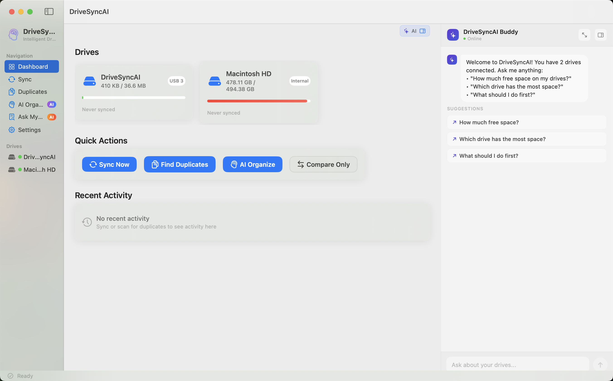
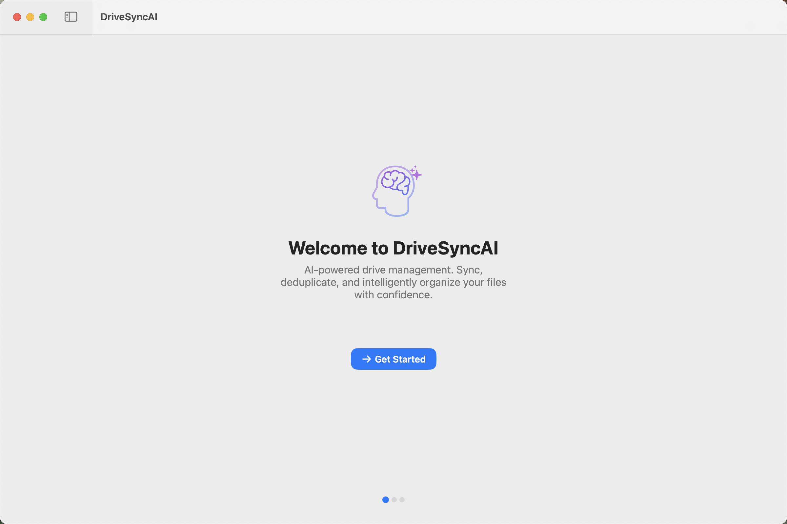
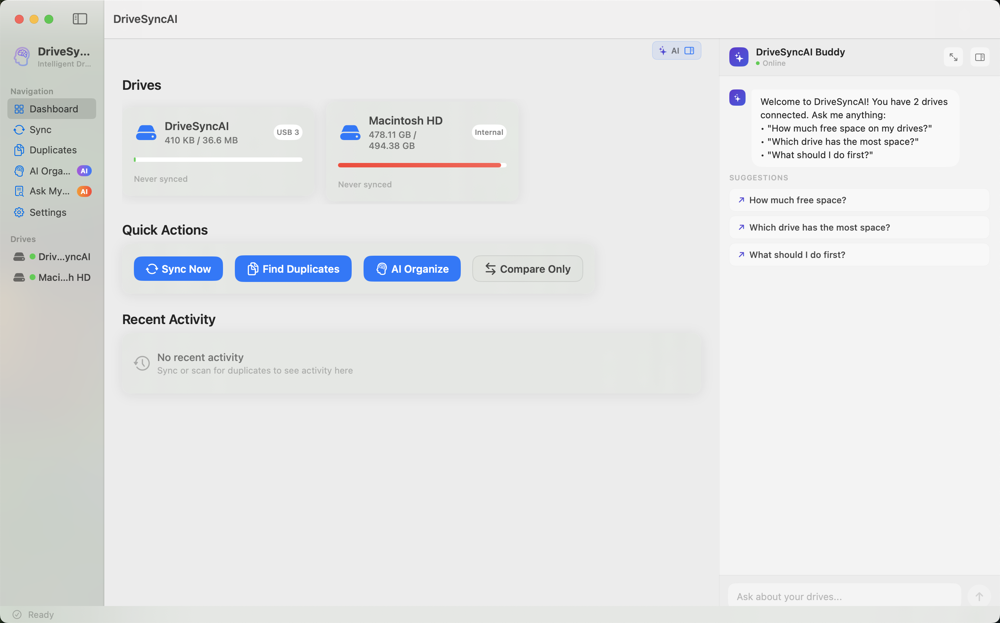
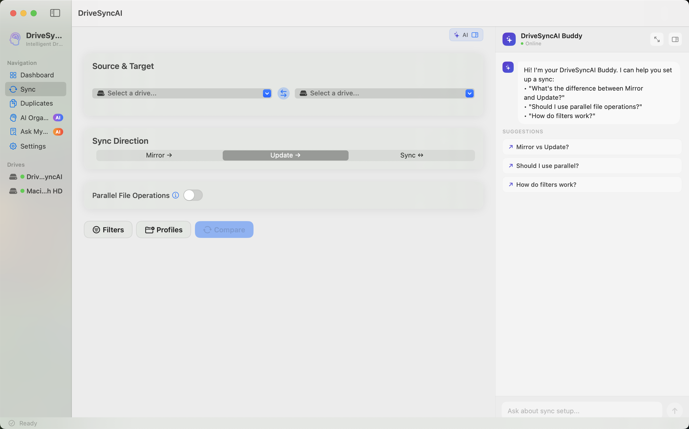
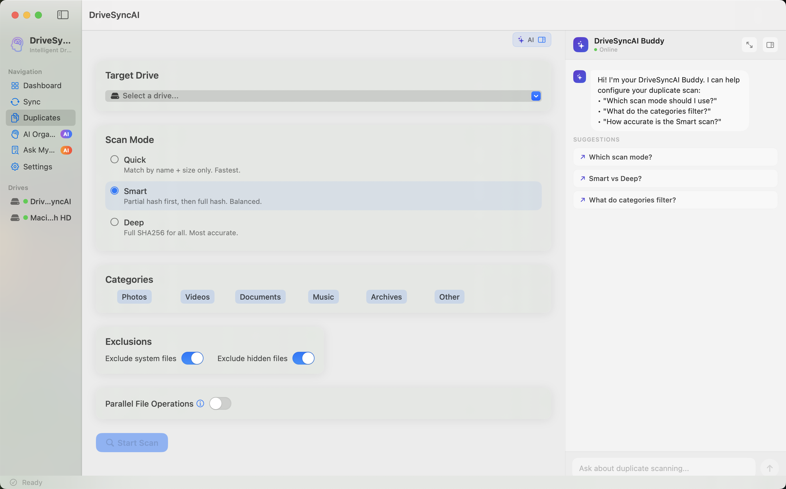
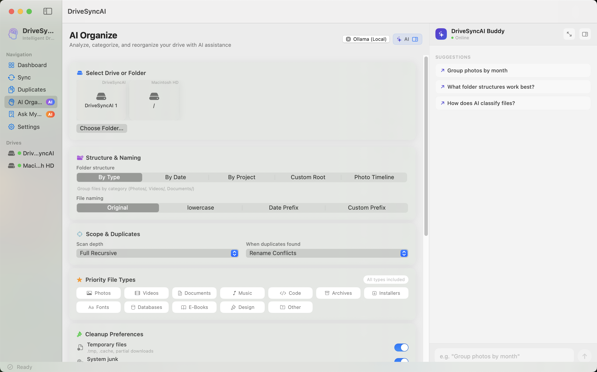
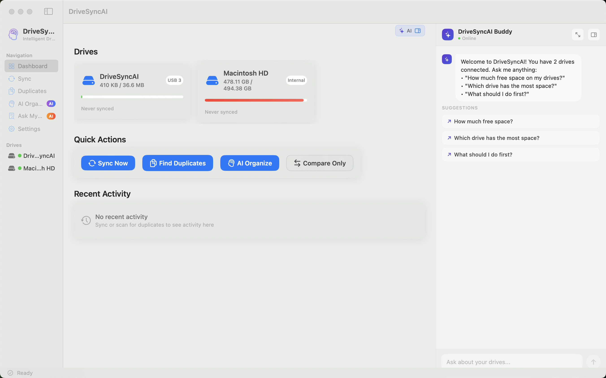
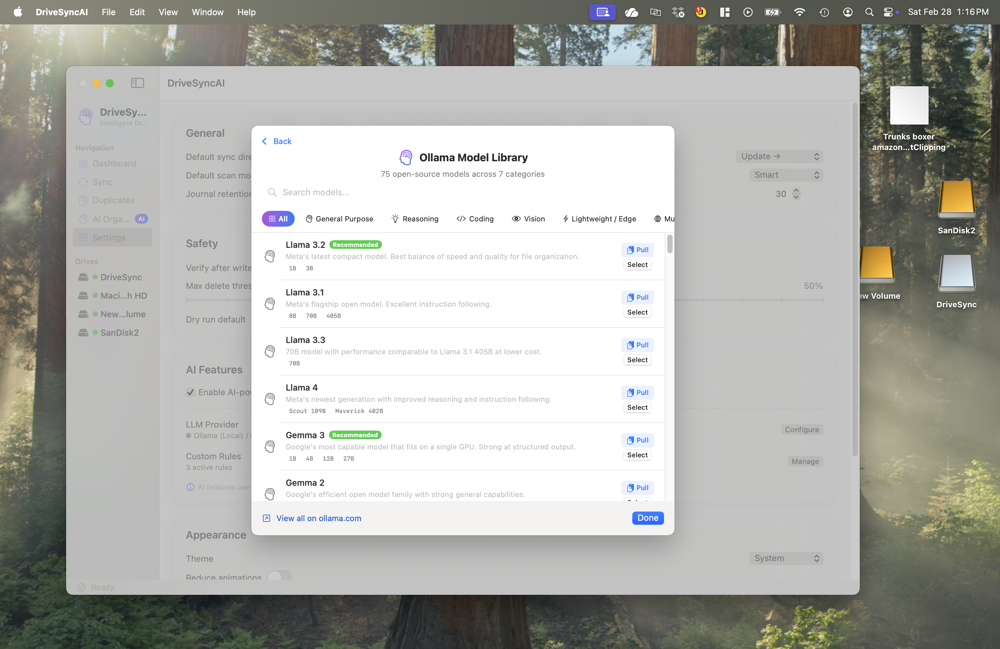

<p align="center">
  
</p>

<h1 align="center">🧠 DriveSyncAI</h1>

<p align="center">
  <strong>The AI-native drive manager with a built-in assistant that syncs, deduplicates, and organizes your files, all through natural conversation.</strong>
</p>

<p align="center">
  <a href="LICENSE"></a>
  
  
  
  
</p>

<p align="center">
  Native macOS app. No subscriptions. No cloud lock-in. AI runs locally by default.<br>
  <strong>Your files. Your rules. Your machine.</strong>
</p>

---

## The Problem

You've got terabytes spread across external drives. Photos from 2015 mixed with tax returns. Three copies of the same vacation folder. A `Downloads` folder that looks like a digital junk drawer.

You've tried syncing manually and accidentally overwrote the wrong version. You've tried duplicate finders but they couldn't tell which copy to keep. You've wished someone would just... organize it all for you.

**DriveSyncAI does exactly that.**

---

## What Makes It Different

| | Other Tools | DriveSyncAI |
|---|---|---|
| **AI Assistant** | None, or a separate window you forget about | Built-in Buddy on every tab. Ask questions, control features, get suggestions. |
| **Sync** | Blind copy, hope for the best | Preview every action, journal every write, verify with SHA256 |
| **Duplicates** | Find them, delete them, pray | Move to structured folder, full undo, original paths preserved |
| **Organization** | Manual drag-and-drop for hours | Preferences wizard + interactive AI chat that edits your plan live |
| **Safety** | "Are you sure?" dialog | Write-ahead journal, verify-after-write, rollback on failure |
| **Privacy** | Upload your files to their cloud | AI runs on-device via built-in engine. Nothing leaves your Mac. |
| **Cost** | $9.99/month forever | Free for personal use. No subscription. Ever. |

---

## Screenshots

<table>
  <tr>
    <td align="center" colspan="2"><br><strong>DriveSyncAI Buddy.</strong> Your AI assistant lives right inside the app as an integrated side drawer. Ask questions, get suggestions, and control every feature through natural conversation.</td>
  </tr>
  <tr>
    <td align="center"><br><strong>Welcome.</strong> AI-branded onboarding experience.</td>
    <td align="center"><br><strong>Dashboard.</strong> Your drives at a glance.</td>
  </tr>
  <tr>
    <td align="center"><br><strong>Sync.</strong> Choose source, target, and direction.</td>
    <td align="center"><br><strong>Duplicates.</strong> Scan by Quick, Smart, or Deep mode.</td>
  </tr>
  <tr>
    <td align="center"><br><strong>AI Organize.</strong> Intelligent file reorganization.</td>
    <td align="center"><br><strong>Settings.</strong> AI features, safety, and appearance.</td>
  </tr>
</table>

---

## Features

### Intelligent Sync

```
Connect Drives → Compare Files → Preview Changes → Approve & Execute → Verify & Journal
```

- **Mirror, Update, or Bidirectional.** Pick the sync strategy that fits.
- **Conflict resolution.** Keep newest, keep both, or decide per-file.
- **Filter rules.** Skip `.git`, `node_modules`, temp files automatically.
- **Sync profiles.** Save configurations for repeated workflows.
- **Versioning.** Automatic backups before any overwrite (trash, timestamped, or numbered).

### Smart Duplicate Finder

```
Select Drive → Quick Scan (name+size) → Smart Partial Hash → Deep SHA256 → Review → Safe Move
```

| Scan Mode | Speed | Accuracy | Best For |
|-----------|-------|----------|----------|
| **Quick** | Seconds | Good | Fast overview by name + size |
| **Smart** | Minutes | Very High | Partial hash, then full SHA256 for matches |
| **Deep** | Thorough | Perfect | Full SHA256 of every file |

- **Category filters.** Scan only photos, videos, documents, music, or archives.
- **Similar file detection.** Catches near-duplicates by name, size, and date.
- **Safe move.** Duplicates go to `Duplicates/` with original folder structure preserved.
- **Full undo.** One click to restore everything back exactly where it was.

### AI-Powered File Organization

This is where DriveSyncAI shines. Instead of spending hours dragging files into folders, let AI do the thinking.

```
Tier 1: Rules Engine       (60%)  Extension mapping → Clutter detection → Custom user rules
Tier 2: Metadata           (25%)  EXIF camera/date/GPS → PDF title/author → Spotlight attributes
Tier 3: AI Brain           (15%)  Compact summary to LLM → AI suggests folders, moves, renames
```

<!--
```mermaid
flowchart TB
    subgraph Tier1["Tier 1 — Rules Engine (60% of files)"]
        R1["Extension Mapping"] --> R2["Clutter Detection"]
        R2 --> R3["Custom User Rules"]
    end

    subgraph Tier2["Tier 2 — Metadata Enrichment (25% of files)"]
        M1["EXIF: Camera, Date, GPS"] --> M2["PDF: Title, Author"]
        M2 --> M3["Spotlight Attributes"]
    end

    subgraph Tier3["Tier 3 — AI Brain (15% of files)"]
        A1["Compact Summary to LLM"] --> A2["AI Suggests: Folders, Moves, Renames, Cleanup"]
    end

    Tier1 --> Tier2
    Tier2 --> Tier3
    Tier3 --> Review["You Review Every Suggestion"]
    Review --> Chat["Refine with AI Chat"]
    Chat --> Execute["Execute with Full Safety Journal"]
-->


**Why this matters:** 85% of your files are organized without touching an AI model. Only truly ambiguous files go to the LLM, as compact metadata, never file contents. This means:

- Minimal token usage (saves money with cloud providers)
- Maximum privacy (file contents never leave your disk)
- Fast results (local rules complete in seconds)

**You approve everything.** Every folder suggestion, file move, rename, and cleanup action appears in a checklist. Nothing happens until you say so.

### DriveSyncAI Buddy: Your Built-In AI Assistant

<p align="center">
  
</p>

DriveSyncAI Buddy is an integrated side-drawer assistant that lives inside every tab of the app. It's not a bolted-on chatbot. It's woven into the core experience. Open it with one click, ask questions in natural language, and watch it take action.

**What the Buddy can do on each tab:**

| Tab | Example Commands |
|-----|-----------------|
| **Dashboard** | "How much free space do I have?" · "Which drive has the most space?" · "What should I do first?" |
| **Sync** | "Sync only photos" · "Deselect all videos" · "Show stats" · "Mirror vs Update?" |
| **Duplicates** | "Keep the newest copies" · "Select photos only" · "Select files > 10MB" |
| **AI Organize** | "Group photos by month" · "Move invoices to Finance/2024" · "Exclude node_modules" |
| **Ask My Docs** | "What were my total expenses?" · "List all income sources" · "Compare these documents" · "Summarize this contract" |
| **Locate My Stuff** | "Where is my pen?" · "Where did I put my keys?" · "Show me the photo of my desk" |
| **Settings** | "Recommend settings for me" · "How do I set up Ollama?" · "What does parallel I/O do?" |

The Buddy adapts its context to whatever you're doing. During sync preview, it can select/deselect files by category, extension, folder, size, or date. During duplicate review, it applies smart selection strategies. During organization, it modifies your plan in real time with highlighted changes.

**Key design decisions:**
- **Integrated, not floating.** The Buddy opens as a side drawer that's part of the layout, not a popup overlay.
- **Context-aware.** Suggestions and quick actions change based on your current tab and state.
- **Expandable.** Click the resize button to widen the panel for longer conversations.
- **Always available.** The Buddy is present on every screen, from initial setup to final review.

### Interactive AI Chat

After scanning, the AI chat opens alongside your plan. Tell it what you want in plain English:

- *"Move all PDFs to a Reports folder"*
- *"Don't touch anything in Downloads"*
- *"Group photos by month instead of type"*
- *"Rename all invoice files with a date prefix"*

The AI modifies your plan in real time: adding moves, changing destinations, excluding files, or triggering a full re-analysis when you change strategy. Changed items are highlighted in the plan view. You can also save the AI's suggestions as reusable custom rules.

### Ask My Docs: Document Intelligence & Cross-Reference

Point to any folder of documents and ask questions in natural language. The system extracts full text (with OCR for scanned documents), classifies the document domain, recommends the best AI model, and returns structured answers with source citations.

- **Everyday Use Cases.** Specialized modes for common tasks:
  - **Receipts:** Extract merchant, date, amount, and category. Detect duplicates and missing details.
  - **Contracts:** Identify key terms, obligations, rights, and critical risks.
  - **Insurance:** Analyze policy details, coverage limits, deductibles, and gaps.
  - **Tax Review:** Compare draft returns against source documents for accuracy and savings.
- **Multi-format extraction.** PDFs, scanned images (OCR), Word, Excel (XLSX), CSV, plain text.
- **Enhanced Privacy Protection.** PII (SSNs, names), PCI (credit cards), and PHI (medical info) are automatically detected and redacted before reaching the AI model. Two sensitivity levels (Standard / Maximum). Luhn validation, SSN format checks, and keyword-proximity matching for high accuracy.
- **Smart Model Advisor.** Detects if your documents are financial, legal, medical, etc. and recommends the best Ollama or cloud model. Pull & Switch for Ollama; Install Ollama prompt when not installed.
- **Document Cross-Reference.** Compare a primary document against source documents to highlight value differences, surface patterns, flag items that may need additional records, and compare versions year-over-year.
- **Report generation.** Export results as PDF, CSV, or Markdown.
- **Multi-folder sources.** Add multiple folders and drives as document sources.

The chat works both **before scanning** (to set preferences) and **after scanning** (to refine the plan). Multi-turn conversation keeps context across messages so you can iterate naturally.

### Locate My Stuff

Never lose your physical items again.

- **Capture:** Take a photo of an item (keys, wallet, passport) or pick from your library.
- **Tag:** Optionally add a location tag (e.g. "Desk", "Living Room").
- **AI Labeling:** The app uses Apple Vision to automatically label objects in the photo.
- **Find:** Ask "Where is my pen?" or "Where are my keys?" to see matching photos with location and date.
- **Local:** All photos and data are stored locally on your device. No cloud uploads.

### AI Engine: Zero Setup Required

DriveSyncAI ships with a **built-in AI engine** powered by [llama.cpp](https://github.com/ggml-org/llama.cpp). No Ollama, no Python, no Homebrew. Just accept the AI disclaimer in-app and it automatically downloads the engine and model (~986 MB one-time).

- **Engine:** llama.cpp (llama-server). Metal-accelerated on Apple Silicon.
- **Model:** Qwen 2.5 1.5B Instruct (Q4_K_M GGUF). Apache 2.0 licensed.
- **Server:** Runs locally on `localhost:8181`. OpenAI-compatible API.
- **Resumable:** Downloads pick up where they left off if interrupted

### Bring Your Own AI

| Provider | Privacy | Setup |
|----------|---------|-------|
| **Built-in** (default) | 100% local, nothing leaves your Mac | Automatic. Accept disclaimer in-app. |
| **Ollama** | All local, nothing leaves your Mac | `brew install ollama && ollama pull llama3.2` |
| **OpenAI** | Cloud, metadata only sent | Add API key in Settings |
| **Anthropic** | Cloud, metadata only sent | Add API key in Settings |
| **Google Gemini** | Cloud, metadata only sent | Add API key in Settings |
| **Perplexity** | Cloud, metadata only sent | Add API key in Settings |

#### 75+ Ollama Models Built In

DriveSyncAI ships with a complete model browser covering every major open-source model on Ollama, organized by category with one-click `ollama pull` command copy:

<p align="center">
  
</p>

**General Purpose:** Llama 3.2, Llama 3.1, Llama 3.3, Llama 4, Gemma 3, Gemma 2, Qwen 3, Qwen 2.5, Mistral, Mixtral, Phi-4, GPT-OSS, Granite, Command R, and more

**Reasoning:** DeepSeek-R1, QwQ, Phi-4 Reasoning, Cogito, Magistral, OpenThinker

**Coding:** Qwen 2.5 Coder, Qwen 3 Coder, DeepSeek Coder, Code Llama, CodeGemma, Codestral, Devstral, StarCoder 2

**Vision:** LLaVA, Llama 3.2 Vision, Qwen3 VL, MiniCPM-V, Moondream, Gemma 3n

**Lightweight:** Phi-4 Mini, SmolLM 2, TinyLlama, LFM 2. Perfect for older Macs.

**Multilingual:** Aya (100+ languages), Yi, Sailor 2

Define your own rules too: pattern-to-folder mappings that run before AI even kicks in.

---

## Safety Architecture

**DriveSyncAI was built by someone who lost files to a sync tool.** Every operation goes through a multi-layer safety pipeline:

```
File Operation → Write-Ahead Journal → Execute → SHA256 Verify → Completion Log
                                           ↓ (on failure)
                                      Automatic Rollback
```

| Layer | What It Does |
|-------|-------------|
| **Write-Ahead Journal** | Every operation logged before execution. Survives crashes. |
| **Verify-After-Write** | SHA256 hash comparison catches silent corruption |
| **APFS Clone Copies** | Backups use instant copy-on-write clones when possible |
| **Backup Before Overwrite** | Original files preserved before any modification |
| **Automatic Rollback** | Incomplete operations fully reversed on failure |
| **Protected Paths** | System directories blocked from modification |
| **Delete Threshold** | Configurable limit prevents mass-deletion accidents |
| **Dry-Run Mode** | Preview the full plan without touching a single file |

---

## Performance

DriveSyncAI automatically tunes concurrency based on your hardware and uses low-level OS primitives to squeeze maximum throughput from every operation:

```
CPU Pool   SHA256 hashing (all cores, mmap for files >4MB)
I/O Pool   File copy/move → APFS clonefile() instant clone → cross-volume fallback

Concurrency tuned per drive:  USB 2.0 → 2  |  USB 3.x → 4  |  Thunderbolt → 6  |  NVMe → 8
```

- **Memory-mapped hashing.** Large files (>4MB) use `mmap` with page-aligned 64MB sliding windows, eliminating kernel buffer copies and syscall overhead.
- **APFS clonefile optimization.** Same-volume copies (duplicate moves, version backups, rollback restores) are instant copy-on-write clones with zero disk overhead. Cross-volume operations fall back transparently.
- **Parallel hashing** across all CPU cores
- **Adaptive I/O scheduling** with backpressure to prevent drive saturation
- **Separate pools** for CPU work and disk I/O. Neither blocks the other.

---

## Quick Start

### Option 1: Build the DMG Installer

```bash
git clone https://github.com/amitchorasiya/DriveSyncAI.git
cd DriveSyncAI
./scripts/build_dmg.sh
open dist/DriveSyncAI-1.1.0.dmg
```

### Option 2: Build from Source

```bash
git clone https://github.com/amitchorasiya/DriveSyncAI.git
cd DriveSyncAI
swift build
swift run
```

**Requirements:** macOS 14+ (Sonoma), Swift 5.9+

### Enable AI

No setup needed. Launch the app, click any **DriveSyncAI Buddy** panel, accept the AI disclaimer, and the app automatically downloads and starts the built-in AI engine. That's it.

Want to use Ollama or a cloud provider instead? Switch anytime in **Settings → AI Provider**.

---

## Architecture

```
SwiftUI Layer      Dashboard · Sync View · Duplicate Finder · AI Organize · Settings
       ↓
Core Services      SyncService · DuplicateFinderService · ReorganizeService
       ↓                              ↓
Safety Layer       SafetyService · AdaptiveScheduler · WriteAheadJournal
       ↓
AI Pipeline        DriveAnalyzer (Tier 1+2) → LLMService (Tier 3) → ChatService (refinement)
                   CustomRulesEngine · LlamaCppServerManager · LLMConfigManager
```

---

## Project Structure

```
DriveSyncAI/
├── Sources/DriveSyncAI/
│   ├── Models/            # FileInfo, SyncAction, DuplicateGroup, ReorganizePlan, LLMProvider...
│   ├── Services/          # SafetyService, SyncService, DuplicateFinder, AdaptiveScheduler...
│   │   └── AI/            # LLMService, DriveAnalyzer, ReorganizeService, OrganizationChatService, CustomRulesService...
│   ├── Views/             # Dashboard, Sync, Duplicates, Settings, Onboarding...
│   │   └── AI/            # AIOrganizeView, ReorganizePlanView, LLMSettings, CustomRulesEditor...
│   ├── Theme/             # Colors, spacing, typography, animations
│   └── Utilities/         # File extensions, path normalization, volume monitoring
├── scripts/               # build_app.sh, build_dmg.sh, generate_icon.swift
├── screenshots/           # App screenshots for documentation
├── LICENSE                # Business Source License 1.1
├── NOTICE                 # Copyright, trademark & third-party notices
└── README.md
```

---

## Contributing

DriveSyncAI is source-available under the Business Source License 1.1. Bug reports and feature suggestions are welcome via [Issues](https://github.com/amitchorasiya/DriveSyncAI/issues).

For commercial licensing inquiries, contact [Amit Chorasiya](https://github.com/amitchorasiya).

---

## License

Copyright 2026 Amit Chorasiya. All rights reserved.

Licensed under the **Business Source License 1.1**:

- **Free** for personal, educational, and non-production use
- **Commercial use** requires a separate license. [Contact me](https://github.com/amitchorasiya).
- Converts to **Apache 2.0** on February 28, 2030

See [LICENSE](LICENSE) for full text.

**DriveSyncAI** is a trademark of Amit Chorasiya. Forks must use a different name. See [NOTICE](NOTICE).

---

<p align="center">
  <strong>DriveSyncAI.</strong> Sync smarter. Organize with AI. Sleep well.<br><br>
  <a href="https://github.com/amitchorasiya/DriveSyncAI/releases">Download</a> · <a href="https://github.com/amitchorasiya/DriveSyncAI/issues">Report Bug</a> · <a href="https://github.com/amitchorasiya">Author</a>
</p>
